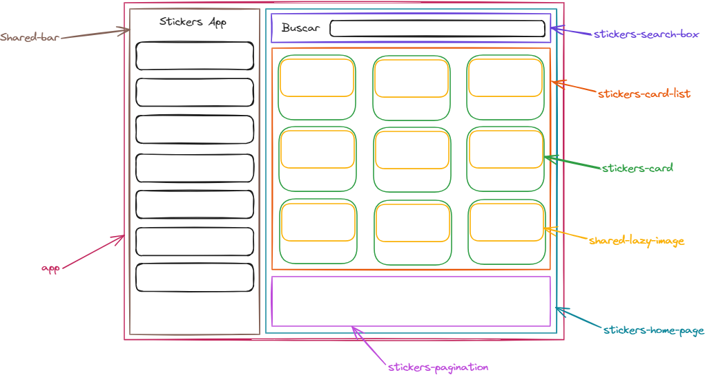
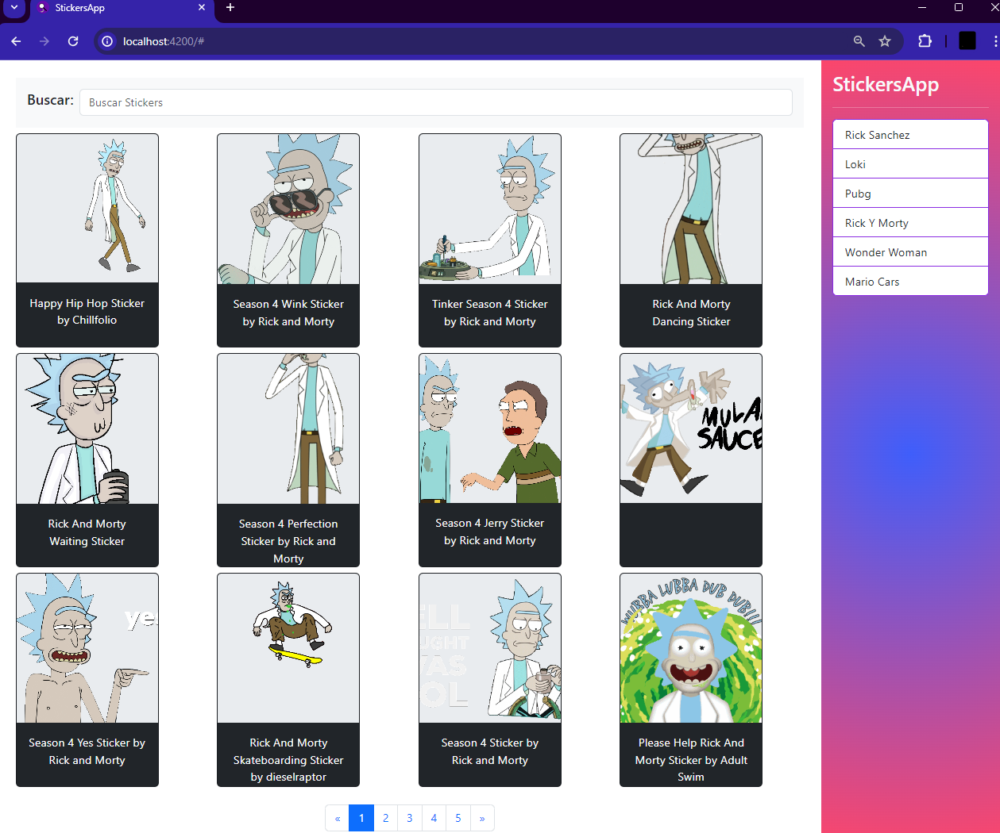

# stickers-app
Aplicación que permite la búsqueda de stickers, consumiendo una API de Giphy con Angular

## ¿Cómo ejecutar el código?
Para ejecutar el servidor de desarrollo, se debe escribir el comando ```ng serve```. Posteriormente, se debe ingresar a la URL `http://localhost:4200/`. Como alternativa se puede ejecutar ```ng serve -o```, este comando abrirá automáticamente la página web con la URL `http://localhost:4200/`

## Build
Run `ng build` to build the project. The build artifacts will be stored in the `dist/` directory.

## Importante
1. Este proyecto fue generado con [Angular CLI](https://github.com/angular/angular-cli) version 16.1.3.
2. Se usa [Bootstrap](https://getbootstrap.com/) para dar estilos en a la página
3. Diseño de la página en base a componentes, de manera que cada componente posee una única responsabilidad

1. Se usa el API suministrada por la plataforma [Giphy](https://giphy.com/apps/giphy), para la consulta de Stickers con el endpoint ```http://api.giphy.com/v1/stickers/search```, para más información dirigirse a la [Documentación](https://developers.giphy.com/docs/api/endpoint/#search) correspondiente
2. Manejo del LocalStorage para el almacenamiento o historial de la información buscada previamente

# Producto final
Diseño final del proyecto de búsqueda de stickers

